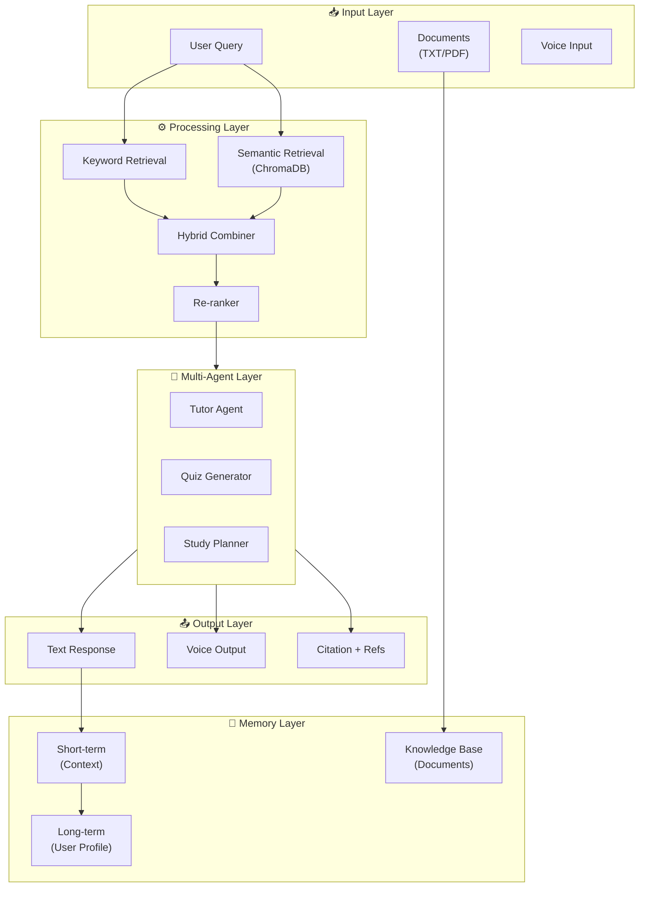

# 🗺️ ScholarBot AI — Roadmap

> Roadmap ini berisi rencana pengembangan ScholarBot AI dari versi saat ini (v3.1) hingga visi jangka panjang.
> Di-update secara berkala seiring progress development.

---

## 📊 Overview Status

| Version | Status | Description |
|---------|--------|-------------|
| **v1.0** | ✅ Released | Initial ScholarBot AI |
| **v2.0** | ✅ Released | Modular architecture refactor |
| **v3.0** | ✅ Released | Lightweight RAG Pipeline |
| **v3.1** | 🔄 Current | Bug fixes & stabilization |
| **v3.2** | 📋 Planned | Enhancement Phase |
| **v4.0** | 📋 Planned | Advanced Features |

---

## 🎯 Version Timeline

```
v1.0 ──── v2.0 ──── v3.0 ──── v3.1 ──── v3.2 ──── v4.0
 │        │        │        │        │
Initial  Modular  RAG     Stable   Enhancements Advanced
Chatbot  Refactor Pipeline Release  (planned)   (future)
```

---

## ✅ Completed Milestones

### v1.0 — Initial Release
- [x] Basic Streamlit chatbot UI
- [x] Groq API integration
- [x] Llama 3.3 70B model
- [x] Simple conversation flow

### v2.0 — Modular Architecture
- [x] Project structure refactor (core, services, ui, prompts)
- [x] Personality modes (Formal, Friendly, Gen Z, Expert)
- [x] Conversational memory
- [x] Session persistence (JSON-based)
- [x] Enhanced prompt engineering

### v3.0 — Lightweight RAG Pipeline
- [x] Document upload (TXT/PDF)
- [x] Text extraction (pypdf + encoding-safe TXT)
- [x] Chunking strategies (paragraph/size-based)
- [x] Keyword-based retrieval (TF scoring)
- [x] RAG context injection
- [x] Document memory tracking

### v3.1 — Stabilization
- [x] Document deletion bug fixes
- [x] RAG injection improvements
- [x] Conversation flow stabilization
- [x] Context-aware follow-up handling

---

## 🚧 v3.2 — Enhancement Phase

> **Target:** Q3 2026
> **Focus:** Improve RAG quality and user experience

### Priority 1 — RAG Improvements
| Feature | Description | Complexity | Status |
|---------|-------------|------------|--------|
| Cross-document retrieval | Score and merge results from multiple documents | Medium | ✅ Done |
| Semantic chunking | Detect natural topic boundaries instead of fixed size | High | |
| Document preview | Show uploaded document content in sidebar | Low | ✅ Done |
| In-document search | Search within uploaded documents | Medium | |

### Priority 2 — UI/UX Enhancements
| Feature | Description | Complexity | Status |
|---------|-------------|------------|--------|
| Document list view | Show all uploaded docs with delete option | Low | ✅ Done |
| Chunk visualization | Display which chunks are retrieved | Medium | ✅ Done |
| Relevance indicator | Show retrieval confidence score | Low | ✅ Done |
| Streaming responses | Stream tokens as they arrive | Medium | ✅ Done |
| Interactive Feedback | Like/Dislike saving feedback to sessions | Low | ✅ Done |

### Priority 3 — Performance
| Feature | Description | Complexity |
|---------|-------------|------------|
| Document summarization | Pre-summarize large docs before chunking | High |
| Retrieval caching | Cache frequent query results | Medium |
| Lazy loading | Load chunks on-demand | Medium |

### Technical Tasks
```
v3.2 Tasks
├── RAG Pipeline
│   ├── [x] Implement cross-document scoring (v3.2)
│   ├── [ ] Add semantic boundary detection
│   ├── [ ] Build document summarization module
│   └── [ ] Improve re-ranking algorithm
├── UI Components
│   ├── [x] Document preview panel (v3.2)
│   ├── [ ] In-document search widget
│   ├── [x] Retrieval confidence display (v3.2)
│   └── [x] Chunk highlighting in response (v3.2)
└── Performance
    ├── [x] Streaming response implementation (v3.2)
    ├── [ ] Retrieval cache system
    └── [ ] Lazy chunk loading
```

---

## 📋 v4.0 — Advanced Features

> **Target:** Q4 2026 - Q1 2027
> **Focus:** Enterprise-grade features and intelligent tutoring

### Phase 1 — Vector Search (High Priority)
| Feature | Description | Tech | Status |
|---------|-------------|------|--------|
| Cosine Similarity NumPy | Semantic search with zero-install local math | NumPy + HF Inference | ✅ Done |
| Embedding model | sentence-transformers/all-MiniLM-L6-v2 | HF inference | ✅ Done |
| Hybrid search | Combine keyword + semantic retrieval | Custom | ✅ Done |
| Citation system | Inline references to document sections | Custom | |

### Phase 2 — Multi-Agent System
| Feature | Description | Status |
|---------|-------------|--------|
| Subject-specialized tutors | Different AI for different subjects | Future |
| Query routing | Route questions to appropriate agent | Future |
| Agent collaboration | Multiple agents working together | Future |

### Phase 3 — Extended Features
| Feature | Description | Priority |
|---------|-------------|----------|
| Persistent memory | Remember user across sessions | High |
| Voice interaction | Text-to-speech for responses | Medium |
| Mobile optimization | Responsive design for phones | Medium |
| Document export | Export chat as PDF/Word | Medium |
| Progress tracking | Track learning progress over time | Medium |

### v4.0 Technical Architecture



---

## 🔮 Long-term Vision

### Intelligent Learning Companion

ScholarBot dirancang untuk berevolusi menjadi:

```
┌─────────────────────────────────────────────────────────┐
│                    ScholarBot AI                         │
│                                                          │
│   ┌─────────────┐  ┌─────────────┐  ┌─────────────┐    │
│   │  Adaptive   │  │  Personal   │  │  Multi-     │    │
│   │  Learning   │→ │  Knowledge  │→ │  Modal      │    │
│   │  Path      │  │  Graph      │  │  Support    │    │
│   └─────────────┘  └─────────────┘  └─────────────┘    │
│                                                          │
│   ┌─────────────┐  ┌─────────────┐  ┌─────────────┐    │
│   │  Real-time  │  │  Progress   │  │  Social     │    │
│   │  Analytics  │→ │  Tracking   │→ │  Learning   │    │
│   │  Dashboard  │  │  & Reports  │  │  Community  │    │
│   └─────────────┘  └─────────────┘  └─────────────┘    │
│                                                          │
└─────────────────────────────────────────────────────────┘
```

### Feature Roadmap by Quarter

| Quarter | Focus Areas |
|---------|------------|
| **Q3 2026** | RAG enhancements, document preview, streaming |
| **Q4 2026** | Vector DB integration, semantic search |
| **Q1 2027** | Multi-agent system, persistent memory |
| **Q2 2027** | Voice interaction, mobile app |
| **Q3 2027** | Analytics dashboard, progress tracking |

---

## 🛠️ Development Guidelines

### Code Standards
- All new features must include unit tests
- Document inline for complex logic
- Follow existing project structure
- Minimum 80% test coverage for core modules

### Testing Strategy
```
┌────────────────────────────────────────┐
│           Testing Pyramid              │
│                                        │
│           /──────────\                 │
│          /   E2E     \                 │
│         /   Tests     \                │
│        /───────────────\               │
│       /   Integration   \              │
│      /     Tests         \             │
│     /─────────────────────\            │
│    /     Unit Tests        \           │
│   /─────────────────────────\          │
│                                        │
└────────────────────────────────────────┘
```

### Release Process
1. Development in feature branches
2. PR reviews required
3. Beta testing on staging
4. Changelog + version bump
5. Semantic versioning (MAJOR.MINOR.PATCH)

---

## 📌 Contributing to Roadmap

### How to Suggest Features
1. Open an issue on GitHub with label `feature-request`
2. Describe the use case and benefit
3. Include mockups or examples if possible

### Priority Guidelines
| Priority | Description | Criteria |
|----------|-------------|----------|
| **P0** | Critical | Breaks core functionality |
| **P1** | High | Major feature, affects many users |
| **P2** | Medium | Enhancement, nice-to-have |
| **P3** | Low | Cosmetic, minor improvement |

---

## 📝 Changelog

### 2026-05-18
- Created dedicated ROADMAP.md from README.md
- Added version timeline and milestones
- Structured v3.2 and v4.0 feature plans
- Added development guidelines

---

**Last Updated:** May 2026
**Current Version:** v3.1 (Stable)
**Next Target:** v3.2 (Enhancement Phase)